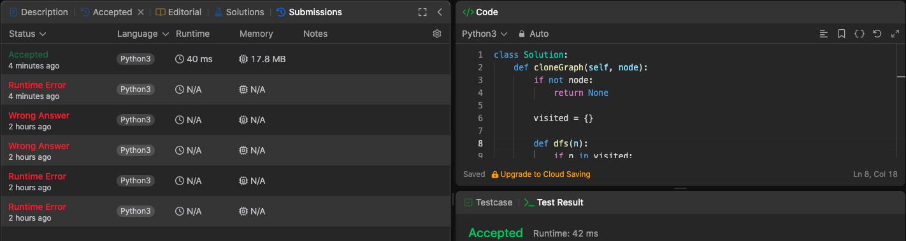

# LeetCode

**Conteúdo da Disciplina**: Grafos 2 

## Alunos
|Matrícula | Aluno |
| -- | -- |
| 21/1039546  |  Joel Soares Rangel |
| 20/0062620  |  Pedro Augusto Dourado Izarias |

## Sobre 
O objetivo desse repositório e acompanhar os conteúdos discutidos na disciplina de Programas e Algoritmos e aplicar o conhecimento na resoluções de questões
do juiz online Leetcode

## Screenshots
Adicione 3 ou mais screenshots do projeto em funcionamento.

## Instalação 
**Linguagem**: Python 

**Requisito**: Ter a linguagem instalada no local de teste.

## Questões resolvidas

- [1791. Find Center of Star Graph](Questoes/1791.py) (Easy)
- [2642. Design Graph With Shortest Path Calculator](Questoes/2642.py) (Hard)
- [1928. Minimum Cost to Reach Destination in Time](Questoes/1928.py) (Hard)
- [133. Clone Graph](Questoes/133.py) (Medium)
  
## Resultados

- [2642 - Design Graph With Shortest Path Calculator](https://leetcode.com/problems/design-graph-with-shortest-path-calculator/description/)  

- [133 - Clone Graph](https://leetcode.com/problems/clone-graph/description/)
 

## Entrega

